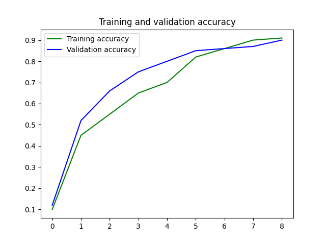
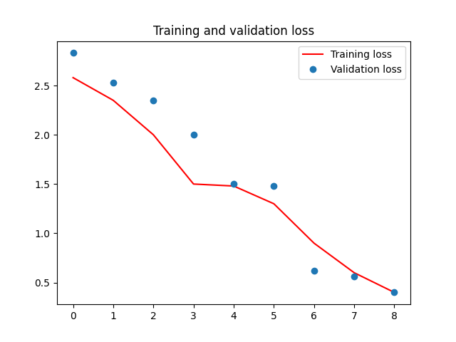

# English to Hindi Translator

This project is a sequence-to-sequence neural network model that translates English sentences to Hindi. The system is built using TensorFlow/Keras and leverages an LSTM-based encoder-decoder architecture for machine translation. The project includes a GUI built with Tkinter to make the translation system user-friendly.

---

## Features
- Translate English sentences to Hindi.
- Simple GUI for user interaction.
- Restriction to allow translations of words starting with vowels only between 9 PM and 10 PM.
- Pre-trained LSTM-based encoder-decoder model.
- Tokenization for input and target languages.

---

## Table of Contents
1. [Installation](#installation)
2. [Usage](#usage)
3. [Model Details](#model-details)
4. [Performance](#performance)
5. [Dataset](#dataset)
6. [Contributing](#contributing)
7. [License](#license)

---

## Installation

### Prerequisites
- Python 3.8 or above
- Conda (for environment management)

### Step 1: Clone the Repository
```bash
git clone https://github.com/your-repo/english-hindi-translator.git
cd english-hindi-translator
```

### Step 2: Create a Conda Virtual Environment

```bash
conda create -n translator-env python=3.8 -y
conda activate translator-env

```

### Step 3: Install Dependencies

pip install -r requirements.txt


# Usage

1. Train the Model

```bash
python train.py
```

2. Run the GUI
   
```bash
python gui.py
```

3. Translate

# Model Details

**Architecture**

The model uses an LSTM-based encoder-decoder architecture:

**Encoder**: Encodes input sequences into fixed-length context vectors.
**Decoder**: Decodes context vectors into target language sequences.

**Data Preprocessing**

English sentences are tokenized, and special tokens (<START> and <END>) are added to Hindi sentences.

Each sentence is converted into a one-hot encoded matrix for training.

# Performance

**Accuracy**

The model achieves high accuracy on the validation set, as shown below:


**Validation Loss**
The validation loss curve indicates effective training convergence:


# Dataset

**English Source**: Data/English.txt
**Hindi Target**: Data/Hindi.txt

Ensure the datasets are placed in the Data/ directory before running the scripts.

# Compatibility

This project is compatible with:

1. Python 3.8+
2. TensorFlow 2.10+
3. Keras 2.10+
4. Numpy 2.x
For other dependencies, see the [requirements.txt]


# GUI (using tkinter)


---

### **requirements.txt**
```plaintext
tensorflow==2.10.1
keras==2.10.0
numpy==1.23.5
pandas==1.5.3
tkinter==0.1.0
```


